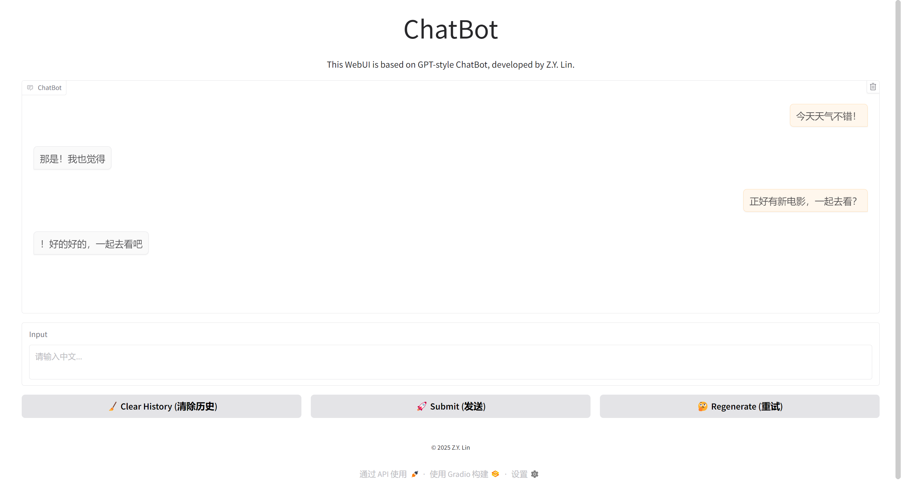

# 小型中文语言模型

> 一个从零开始搭建的小型语言模型，初步实现上下文对话功能，支持命令行交互和 Gradio Web UI 部署。



## 特点

* 🎓 **快速入门**：从零搭建亿级参数量语言模型，覆盖数据预处理、词表构建、模型实现、训练与评估的完整流程，代码结构清晰
* 🤖 **采用 GPT-style 的 Transformer 架构**
* 💬 **多模式交互**：
  * 命令行聊天（`run/chatbot.py`）
  * Gradio Web 界面（`run/web_demo.py`）

## 目录结构

```
ChatBot
├── data/
│   └── chinese-cosmopedia
├── run/
│   ├── chatbot.py
│   ├── web_demo.py
│   └── utils.py
├── data.py
├── model.py
├── train.py
```

## 克隆仓库

```bash
git clone https://github.com/lin-zy23/ChatBot.git
cd ChatBot
```

## 环境依赖

```bash
# 创建并激活 conda 环境
conda create -n chatbot python=3.8 -y
conda activate chatbot

# 安装 PyTorch 1.11.0 + CUDA 11.5
pip install torch==1.11.0+cu115 -f https://download.pytorch.org/whl/cu115/torch_stable.html

# 安装其他依赖
pip install tqdm gradio
```

## 数据集准备

请将训练/验证/测试集放在 `data/chinese-cosmopedia/` 目录下（下载地址：[https://modelscope.cn/datasets/opencsg/chinese-cosmopedia](https://modelscope.cn/datasets/opencsg/chinese-cosmopedia)），格式如下：

```
data/chinese-cosmopedia/data/
├── 00000.parquet
├── 00001.parquet
├── ……
└── 00057.parquet
```

## 模型训练

```bash
# 单卡训练
python train.py --devices 0 --epochs 5

# 多卡分布式训练（以双卡为例）
OMP_NUM_THREADS=2 CUDA_VISIBLE_DEVICES=0,1 python -u -m torch.distributed.run --nproc_per_node=2 train.py --distributed --devices 0,1 --epochs 5
```

## 聊天 & 部署

### 命令行交互

```bash
python run/chatbot.py --model chatbot.pt --tokenizer tokenizer.json
```

### Gradio Web 界面

```bash
python run/web_demo.py --model chatbot.pt --tokenizer tokenizer.json
```

## 许可证

本项目基于 Apache License 2.0 开源，详见 [LICENSE](LICENSE) 文件。
